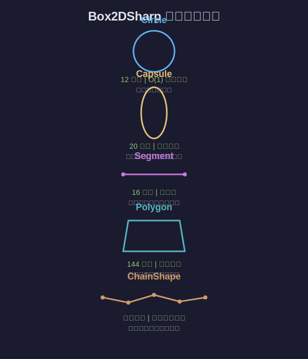
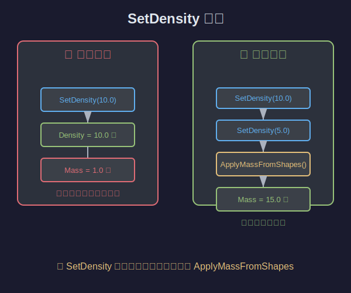
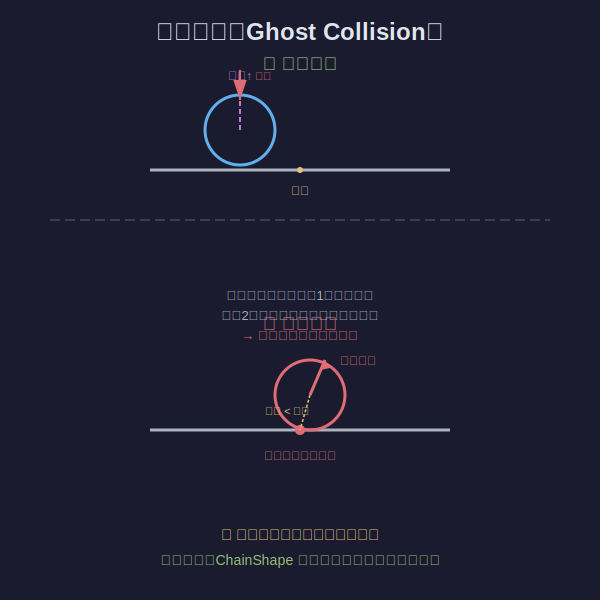
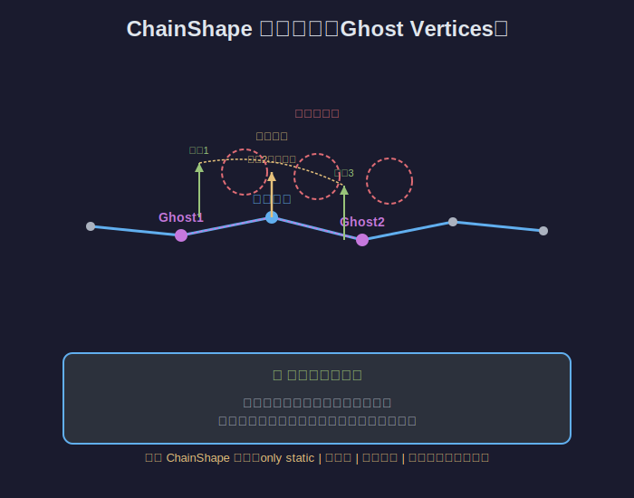

# Box2D Chapter 4 学习笔记

**日期**: 2026-04-16
**章节**: Chapter 4 - 形状系统
**课时**: 第4课（续上节课，从知识点5开始）



---

## 本次学习内容

### 知识点5：运行时修改形状的 API 和注意事项



**核心API**：
- `SetDensity(shapeId, density)` - 修改密度
- `SetFriction(shapeId, friction)` - 修改摩擦力
- `SetRestitution(shapeId, restitution)` - 修改弹性
- `SetCircle/SetCapsule/SetSegment/SetPolygon` - 运行时切换几何类型

**大坑**：SetDensity 不会自动重新计算质量！必须手动调用 `ApplyMassFromShapes`

**为什么SetDensity不自动更新质量？**
- 更新质量需要遍历所有形状、计算质心、计算转动惯量，开销较大
- 如果在循环里对多个形状调用SetDensity，每次都更新质量会重复计算
- 设计成手动调用，让开发者决定何时更新（通常改完所有形状后统一更新一次）

**world.Locked 检查**：
- SetFriction/SetRestitution 在 world.Locked 时会被静默忽略
- world.Locked = true 是在物理步（World.Step）进行中
- 不能在碰撞回调里直接修改这些属性，要缓存到下一帧

```csharp
// 错误做法
for (int i = 0; i < table.ShapeCount; i++)
{
    Shape.SetDensity(shapeId[i], newDensity);
    Body.ApplyMassFromShapes(bodyId);  // 重复计算5次！
}

// 正确做法
for (int i = 0; i < table.ShapeCount; i++)
{
    Shape.SetDensity(shapeId[i], newDensity);
}
Body.ApplyMassFromShapes(bodyId);  // 只计算1次
```

**ResetProxy 开销**：
- SetCircle/SetPolygon 等切换几何类型会调用 ResetProxy
- 销毁该形状所有接触 + 重建宽相代理（更新AABB和动态树）
- 低频操作（按键触发）可放心用，高频操作（每帧Update）要小心

---

### 知识点6：ApplyMassFromShapes 的重要性

**做了三件事**：
1. **累加质量**：遍历所有形状，面积 × 密度，求和得到总质量
2. **计算质心**：所有形状中心的加权平均
3. **计算转动惯量**：物体绕质心旋转的难易程度

**调用时机**：
- CreateShape 时自动调用（如果 body.AutomaticMass == true）
- SetDensity 后手动调用
- SetCircle/SetPolygon 等切换几何后手动调用

**忘记调用的后果**：密度变了但质量没变，刚体受力行为异常

---

### 知识点7：ChainShape 的设计与限制



**解决幽灵碰撞（Ghost Collision）**：
- 多个独立线段拼成地面时，球滚到接缝处会被内侧尖角弹飞
- 原因：每个线段独立检测碰撞，接缝处的端点离球很近，引擎误判为碰撞
- ChainShape 用**幽灵顶点（Ghost Vertices）**平滑过渡碰撞法线

**四大限制**：
1. 只能用于静态刚体（StaticBody）
2. 无质量（线段没有体积）
3. 单向碰撞（默认逆时针环绕，内部在左侧）
4. 开放链首尾边无碰撞（IsLoop=false 时第一条和最后一条边不参与碰撞）



**ChainDef 参数**：
```csharp
ChainDef chainDef = ChainDef.DefaultChainDef();
chainDef.Points = new Vec2[] { (-2,0), (0,0), (2,0), (4,0) };
chainDef.IsLoop = true;   // 是否首尾相连
chainDef.Friction = 0.6f;
```

---

### 知识点8：ShapeDef 的 InternalValue 校验机制

- InternalValue 是一个校验暗号（Core.SecretCookie）
- 必须用 `ShapeDef.DefaultShapeDef()` 初始化，不能直接 `new ShapeDef()`
- 忘记初始化 → 调试期断言失败，程序崩溃
- ShapeDef 是临时对象，可以复用创建多个形状

---

### 知识点9：事件开关家族的用途

| 开关 | 默认值 | 用途 | 性能 |
|------|--------|------|------|
| EnableSensorEvents | true | 传感器事件（触发区域、拾取范围） | 可接受 |
| EnableContactEvents | true | 接触事件（碰撞反馈、伤害判定） | 可接受 |
| EnableHitEvents | false | 命中事件（子弹命中、攻击判定） | 有额外开销 |
| EnablePreSolveEvents | false | 预解算事件（单向平台），只对DynamicBody生效 | **开销很大，慎用** |

---

### 知识点10：UnionShape 的内存联合体设计

- Shape 类用联合体把所有几何变体重叠存储
- 所有形状统一占用 144 字节（Polygon 的大小）
- **好处**：缓存友好、无虚函数分发、无运行时类型判断
- **代价**：小形状（Circle 12字节）浪费内存
- 典型工程取舍：**用空间换一致性，追求稳定帧率**

---

## 面试要点

1. SetDensity 修改密度后为什么要手动调用 ApplyMassFromShapes？
2. 为什么不能在碰撞回调里修改形状属性？
3. ChainShape 的幽灵顶点解决什么问题？
4. UnionShape 为什么要用内存联合体设计？
